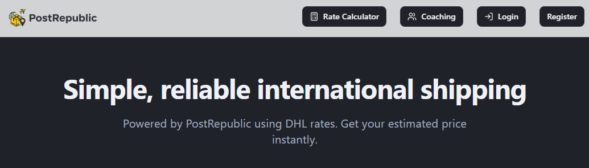

# Courier Service Project

## Project Overview

This is a modern courier service management platform tailored for DHL shipments, built to simplify postage operations for both users and administrators. The system allows customers to create delivery orders, check pricing based on destination zones using a stored DHL rate card, and track their shipments in real-time.

Users must sign in with their own credentials to view their order history, track previous shipments, and manage new requests. On the backend, admins manage pricing data, order records, and zone mappings using Supabase as the database and authentication platform.

Key highlights:

- User authentication with personalized order history

- Dynamic pricing based on country zones and DHL rate card

- Real-time shipment tracking

- Admin dashboard powered by Supabase for data management

## Live Demo

[](https://www.postrepublic.my/)

*Click the image above to visit the live website*

## Getting Started

### Prerequisites

Before you begin, ensure you have the following installed:
- Node.js & npm - [Install with nvm](https://github.com/nvm-sh/nvm#installing-and-updating)

### Installation

Follow these steps to set up the project locally:

```sh
# Step 1: Clone the repository
git clone <YOUR_GIT_URL>

# Step 2: Navigate to the project directory
cd courier-service

# Step 3: Install dependencies
npm i

# Step 4: Start the development server
npm run dev
```

## Development

### Available Scripts

- `npm run dev` - Starts the development server with hot-reloading
- `npm run build` - Builds the application for production
- `npm run preview` - Previews the production build locally

## Technology Stack

This project is built with modern web technologies:

- **Vite** - Next Generation Frontend Tooling
- **TypeScript** - For type-safe code
- **React** - UI Library
- **shadcn-ui** - Beautiful UI components
- **Tailwind CSS** - Utility-first CSS framework

## Features

- Real-time delivery tracking
- Customer management
- Delivery scheduling
- Route optimization
- Analytics dashboard
- Mobile-responsive design

## License

This project is licensed under the MIT License - see the LICENSE file for details.

## Support

For support, please open an issue in the GitHub repository or contact the development team.

Visit my profile at www.Nexflow.biz
